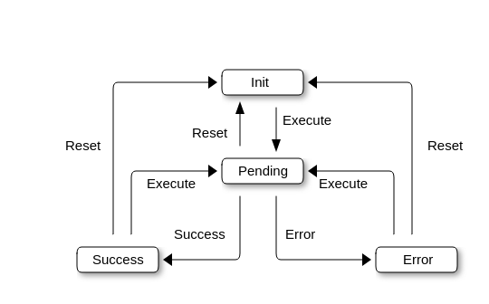

# A Word About NetworkState

By nature, network calls are asynchronous. Therefore, in most HTTP clients, network call results are modeled using promises. Promises work well with JavaScript, yet in React components, they can lead to confusion. Intrig prefers states over promises, as handling state is more natural within React. States are better suited for managing network requests in React components because they integrate seamlessly with React's behavior, making it easier to trigger re-renders and manage UI updates as the network request progresses.

---

## Network State

Intrig introduces a new generic type `NetworkState<T>`. It follows a predefined state flow, as described below.

**Network State Diagram**



- **Init**: This state indicates that the network call has not yet been initiated.
- **Pending**: Once the call is initiated, the `NetworkState` moves to the Pending state. Loaders can be rendered during this state.
- **Success**: The `NetworkState` moves to this state upon the successful completion of the network call. This state contains a property called `data` which holds the result of the execution, typically of type `T`, where `T` represents the expected response data type.
- **Error**: The `NetworkState` moves to this state if the network call fails. This state contains metadata about the failure.

---

## Typesafe Utilities

Some utility functions contain additional information related to the operation, such as the current state of the network request, any associated metadata, and helpful methods to interact with the state. To extract this information, Intrig provides a set of utility functions, as described below:

### isInit

This function checks whether the `NetworkState` is in the init state. Usage is shown below:

```jsx
function MyComponent() {
    const [state] = useYourGeneratedHook();

    if (isInit(state)) {
        return <InitStateContent />;
    }

    return null;
}
```

### isPending

This function checks whether the `NetworkState` is in the pending state. Loaders can usually be rendered in this state.

```jsx
function MyComponent() {
    const [state] = useYourGeneratedHook();

    if (isPending(state)) {
        return <Loader />;
    }

    return null;
}
```

### isSuccess

This function checks whether the `NetworkState` is in the success state. This state contains the result in the `data` property, as shown below:

```jsx
function MyComponent() {
    const [state] = useYourGeneratedHook(); 

    // To ensure type safety, always explicitly check that the state is in the Success state before accessing properties like `data`.
    //console.log(state.data); <- this reesults an error
    if (isSuccess(state)) {
        return <SuccessContent data={state.data}/>;
    }

    return null;
}
```

### isError

This function checks whether the `NetworkState` is in the error state. This state contains the error in the `error` property, as shown below:

```jsx
function MyComponent() {
    const [state] = useYourGeneratedHook();

    if (isError(state)) {
        return <Error error={state.error}/>;
    }

    return null;
}
```

